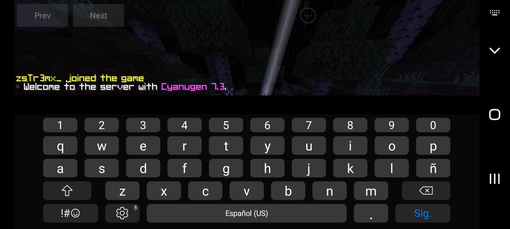

# Cyanugen Login

## Description

The **Cyanugen Login** plugin allows users of the Cyanugen client to log into Minecraft servers and enable their scripts.

## Features

- **Easy Login**: Players can quickly log into servers.
- **Script Support**: Users can enable custom scripts for added functionality.
- **Compatibility**: Designed to work specifically with the Cyanugen client.

## Requirements

- **PocketMine-MP**: Make sure you have a compatible version of PocketMine-MP installed.
- **Cyanugen Client**: Players must use the Cyanugen client to access this plugin.

## Installation

1. Download the plugin.
2. Place the plugin file in the `plugins` folder of your PocketMine server.
3. Restart the server to activate the plugin.
4. Players can log in using the Cyanugen client.

